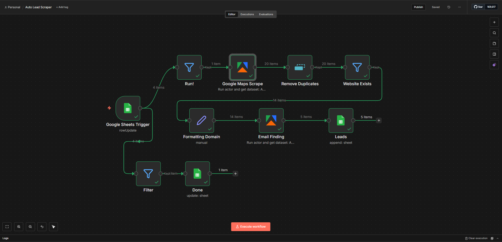
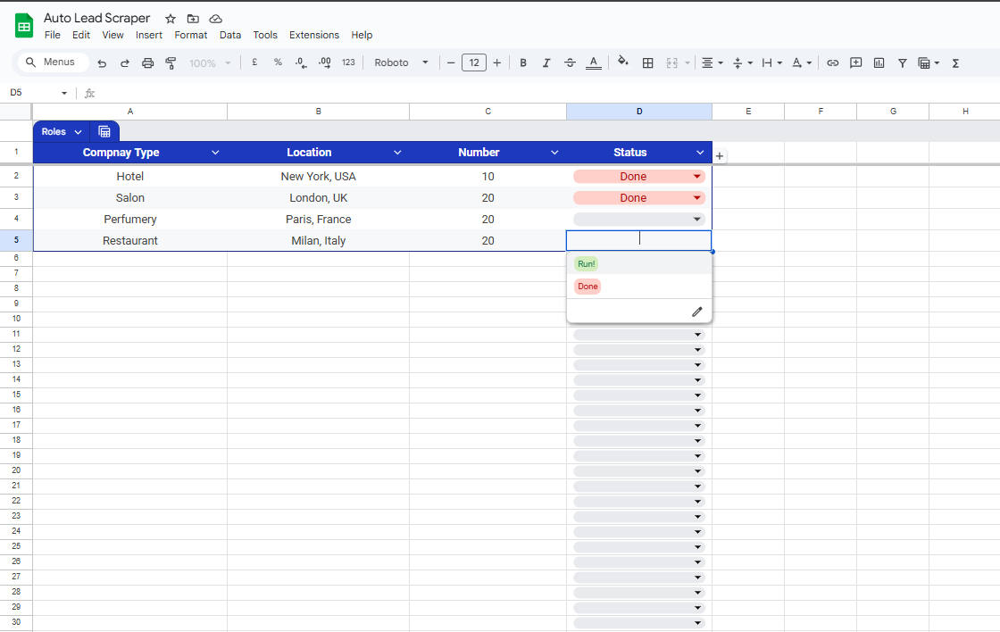
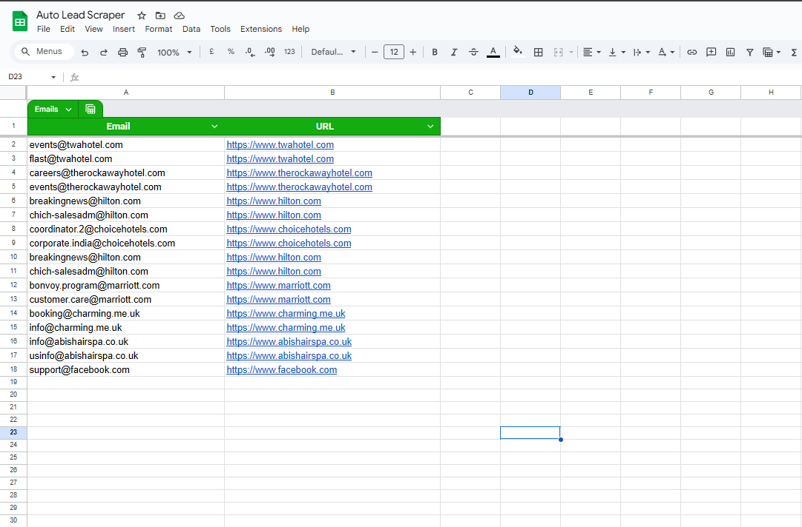

# GoogleMaps Business Email Scraper

Find and collect business leads from Google Maps with automated email extraction using n8n workflow automation. This solution saves hours of manual research by scraping businesses, finding emails, and organizing results in Google Sheets.

## 🚀 Why This Automation?

**The Problem:**
- Manual lead generation takes 10-15 hours per week
- Hiring virtual assistants costs $500-1000/month
- Repetitive data entry leads to human errors
- Missing opportunities due to slow prospecting

**The Solution:**
- ⚡ **Saves 40+ hours/month** on manual research
- 💰 **Reduces costs by 80%** compared to hiring VAs
- 🎯 **Accurate & consistent** data collection
- 🔄 **Fully automated** - set it and forget it

**ROI:** Pay once, save thousands in labor costs yearly.

## 📋 Project Overview

This is an end-to-end automated lead generation system built with n8n workflow automation platform. The system orchestrates multiple services and APIs to create a seamless pipeline from data collection to organized output.

**What It Does:**
- Monitors Google Sheets for trigger events
- Scrapes Google Maps based on business type and location
- Filters businesses with valid websites
- Removes duplicate entries automatically
- Extracts domain information from URLs
- Finds verified email addresses from business websites
- Appends structured data to Google Sheets
- Updates workflow status for tracking

---

## 💼 Looking for Custom Automation Solutions?

I build intelligent automation workflows and AI agents that solve real business problems. Whether you need lead generation, data processing, or workflow optimization - I can help.

### 📞 Let's Talk About Your Project

- **Email:** [adeelmemon096@yahoo.com](mailto:adeelmemon096@yahoo.com)
- **WhatsApp:** [+923147116890](https://wa.me/923147116890)
- **LinkedIn:** [linkedin.com/in/adeeliqbalmemon](https://linkedin.com/in/adeeliqbalmemon)

**Services I Offer:**
- Custom n8n workflow automation
- AI-powered lead generation systems
- Business process automation
- Integration & API development

---

## ✨ Features

- **Google Maps Scraping** - Extract businesses by location and type
- **Automated Email Finding** - Discover contact emails from websites
- **Duplicate Removal** - Clean, unique leads only
- **Google Sheets Integration** - Organized, ready-to-use data
- **Status Tracking** - Monitor automation progress in real-time

## 📊 Results

## 🛠️ How It Works

1. Add your target criteria (business type, location, quantity) to Google Sheets
2. Set status to "Run!"
3. Automation scrapes Google Maps for matching businesses
4. Extracts website emails automatically
5. Organizes clean data in your spreadsheet
6. Updates status to "Done"

## 🏗️ Architecture

The workflow follows a **multi-stage pipeline architecture**:

1. **Trigger Layer** - Google Sheets event monitoring
2. **Validation Layer** - Status filtering and data validation
3. **Extraction Layer** - Google Maps scraping via Apify
4. **Transformation Layer** - Duplicate removal and domain formatting
5. **Enrichment Layer** - Email discovery from websites
6. **Storage Layer** - Structured append to Google Sheets
7. **Status Management** - Automated completion tracking

---

## 📈 Perfect For

- Sales teams looking for B2B leads
- Marketing agencies building prospect lists
- Freelancers offering lead generation services
- Startups validating market opportunities
- Anyone tired of manual data collection

---

### 🤝 Need This Customized?

Every business has unique needs. I can tailor this automation to:
- Target specific industries or locations
- Add custom data fields
- Integrate with your CRM
- Include AI-powered personalization
- Scale to handle thousands of leads

**Get in touch** - Let's build something amazing together!

📧 adeelmemon096@yahoo.com | 💬 [WhatsApp](https://wa.me/923147116890) | 💼 [LinkedIn](https://linkedin.com/in/adeeliqbalmemon)
